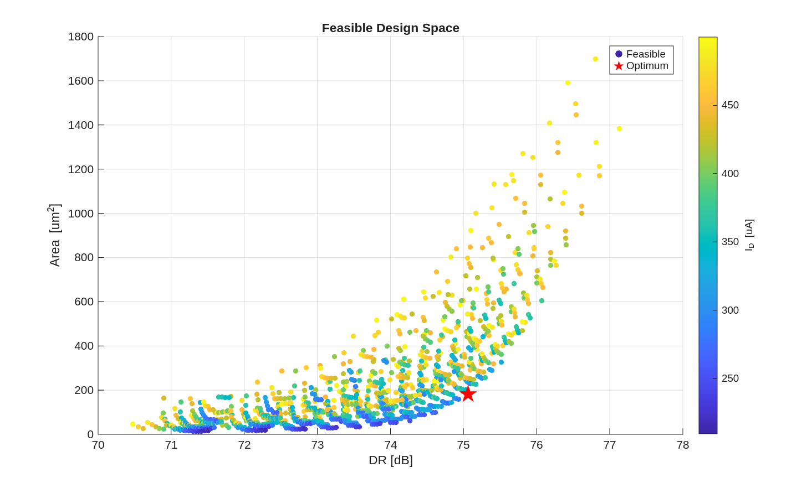
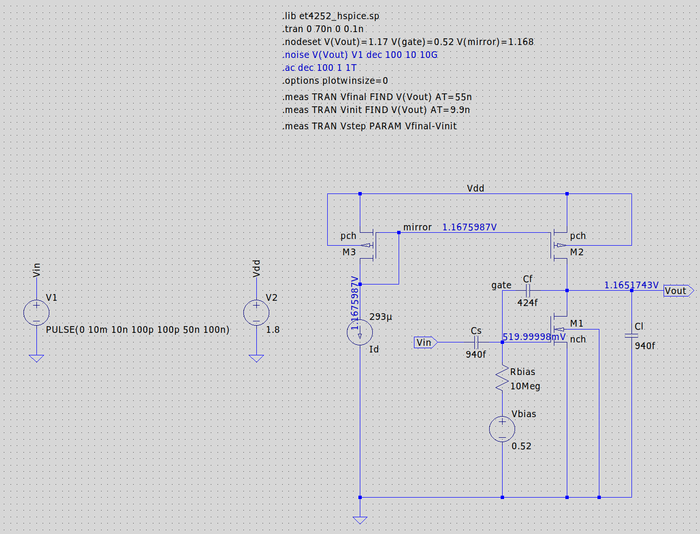

# ET4252 Analogue Integrated Circuit Design

Coursework and design project for ET4252 at TU Delft, done with Raghavendra Joshi. The thread through the repo is the gm/Id design methodology: characterize 180 nm CMOS devices once, build MATLAB lookup tables, then size circuits analytically and verify in SPICE.

## Design project: intrinsic gain stage with active PMOS load

Design of a capacitive-feedback intrinsic gain stage (closed-loop gain 2, fan-out 1) in 180 nm CMOS, with the ideal current source replaced by a PMOS mirror load. The goal was to minimize total transistor area and maximize dynamic range under hard specs: static error ≤ 8%, settling to 0.1% within 5.5 ns, I_D ≤ 500 μA, and ≤ 100 μVrms integrated output noise (10 Hz to 10 GHz).

The design flow (`igs_cap_sizing.m`) sweeps gm/Id for both devices and the capacitor budget, checks every spec analytically from the lookup tables, and only then goes to LTspice for verification. The full write-up is [ET4252_Project_Tyukov_5714699.pdf](project/ET4252_Project_Tyukov_5714699.pdf).

Every dot is a spec-compliant design; the star marks the chosen optimum on the area/DR Pareto front (about 75 dB DR at under 200 μm² and roughly 290 μA).

The verified stage: NMOS driver M1 with C_S/C_F capacitive feedback, PMOS load M2 biased through mirror M3. Supporting plots in `project/` cover the noise spectral density and its running integral, transient step response, dynamic error, and the DR versus gm/Id trade-off. MATLAB predictions and SPICE agreed within the 10% target of the methodology.

## Homework

- `hw1/` closed-form analysis exercises (submitted report).
- `hw2/` device characterization for the gm/Id method: operating point and DC sweeps of the 180 nm BSIM3v3 devices in LTspice at several bias points (`hw2/imgs/`), cross-checked against the HSPICE model deck, with the write-up in `hw2/hw2_report.md` and `hw2/hw1_gm_id.pdf`.

## Repository layout

| Path | Contents |
| --- | --- |
| `project/` | gm/Id sizing scripts, LTspice schematic and runs, plots, final report |
| `hw2/` | Device characterization schematics, sim logs, report |
| `hw1/` | Homework 1 report |
| `tools/` | Shared gm/Id lookup tables (`180nch.mat`, `180pch.mat`) and `look_up.m` utilities |

Tools: LTspice (BSIM3v3 180 nm models), MATLAB with the Murmann-style lookup functions, LaTeX for reports.
