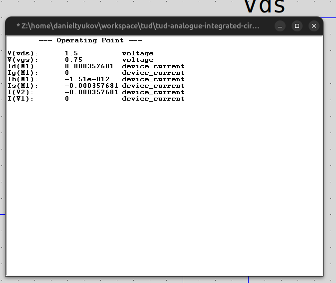
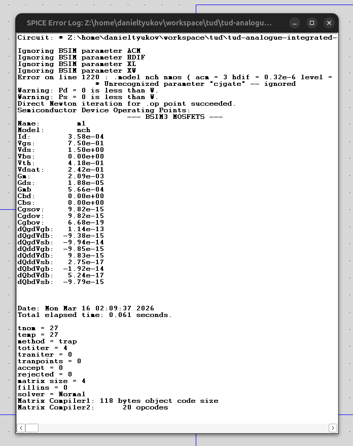

# Homework Assignment 2

## ANALOGUE INTEGRATED CIRCUIT DESIGN — ET4252

**Authors:** Raghavendra Joshi (6438180), Daniel Tyukov (5714699)

---

## Part A

Use an operating point simulation (.op) to measure the drain current of an NMOS transistor with $W/L = 5\,\mu m\,/\,0.18\,\mu m$ at $V_{DS} = 1.5\,V$ and $V_{GS} = 0.6\,V$ and $1.5\,V$.

### Circuit


NMOS M1 with `nch` model (BSIM3v3, 180nm technology), $W/L = 5\,\mu m\,/\,0.18\,\mu m$. $V_{DS} = 1.5\,V$ provided by V2, $V_{GS}$ swept via V1. Bulk tied to source (ground).

### Operating Point Results

| $V_{GS}$ | $V_{DS}$ | $I_D$       |
|-----------|----------|-------------|
| $0.6\,V$  | $1.5\,V$ | $79.26\,\mu A$ |
| $1.5\,V$  | $1.5\,V$ | $2.284\,mA$    |

**$V_{GS} = 0.6\,V$:**


**$V_{GS} = 1.5\,V$:**


---

## Part B

Using the data from part (a), estimate the threshold voltage $V_t$ and $\mu_n C_{ox}(W/L)$ assuming the square-law model.

### Method

The square-law model in saturation (neglecting finite output resistance):

$$I_D = \frac{1}{2}\,\mu_n C_{ox}\,\frac{W}{L}\,(V_{GS} - V_t)^2$$

Let $K = \frac{1}{2}\,\mu_n C_{ox}\,\frac{W}{L}$. From the two simulated data points:

$$I_{D1} = K\,(V_{GS1} - V_t)^2 \quad \Rightarrow \quad 7.92583 \times 10^{-5} = K\,(0.6 - V_t)^2$$

$$I_{D2} = K\,(V_{GS2} - V_t)^2 \quad \Rightarrow \quad 2.28405 \times 10^{-3} = K\,(1.5 - V_t)^2$$

Dividing $I_{D2}\,/\,I_{D1}$ eliminates $K$:

$$\frac{I_{D2}}{I_{D1}} = \frac{(V_{GS2} - V_t)^2}{(V_{GS1} - V_t)^2}$$

### Solving for $V_t$

$$r = \sqrt{\frac{I_{D2}}{I_{D1}}} = \sqrt{28.818} = 5.368$$

$$r\,(V_{GS1} - V_t) = V_{GS2} - V_t$$

$$V_t = \frac{r \cdot V_{GS1} - V_{GS2}}{r - 1} = \frac{5.368 \times 0.6 - 1.5}{5.368 - 1} = 0.394\,V$$

### Solving for $\mu_n C_{ox}(W/L)$

$$K = \frac{I_{D1}}{(V_{GS1} - V_t)^2} = \frac{7.92583 \times 10^{-5}}{(0.206)^2} = 1.868 \times 10^{-3}\,A/V^2$$

$$\mu_n C_{ox}\frac{W}{L} = 2K = 3.736 \times 10^{-3}\,A/V^2 = 3.736\,mA/V^2$$

Extracting $\mu_n C_{ox}$ alone ($W/L = 5/0.18 = 27.78$):

$$\mu_n C_{ox} = \frac{3.736 \times 10^{-3}}{27.78} = 134.5\,\mu A/V^2$$

### Summary

| Parameter              | Extracted Value             |
|------------------------|-----------------------------|
| $V_t$                  | $\mathbf{0.394\,V}$        |
| $\mu_n C_{ox}(W/L)$   | $\mathbf{3.736\,mA/V^2}$   |
| $\mu_n C_{ox}$         | $\mathbf{134.5\,\mu A/V^2}$ |

---

## Part C

Using the results from part (b), calculate the drain current and transconductance of an NMOS with $W/L = 20\,\mu m\,/\,0.7\,\mu m$ at $V_{DS} = 1.5\,V$ and $V_{GS} = 0.75\,V$ using the square-law formula. Then compare against LTSpice simulation.

### Square-Law Prediction

Using extracted parameters from part (b): $V_t = 0.394\,V$, $\mu_n C_{ox} = 134.5\,\mu A/V^2$.

New aspect ratio: $W/L = 20/0.7 = 28.571$.

**Drain current:**

$$I_D = \frac{1}{2}\,\mu_n C_{ox}\,\frac{W}{L}\,(V_{GS} - V_t)^2 = \frac{1}{2} \times 134.5 \times 10^{-6} \times 28.571 \times (0.75 - 0.394)^2$$

$$I_D = 1.922 \times 10^{-3} \times (0.356)^2 = 1.922 \times 10^{-3} \times 0.1267 = 243.6\,\mu A$$

**Transconductance:**

$$g_m = \mu_n C_{ox}\,\frac{W}{L}\,(V_{GS} - V_t) = 134.5 \times 10^{-6} \times 28.571 \times 0.356 = 1.368\,mS$$

### LTSpice Simulation

Same circuit as part (a), with M1 changed to $W/L = 20\,\mu m\,/\,0.7\,\mu m$, $V_{GS} = 0.75\,V$, $V_{DS} = 1.5\,V$.





Simulation results: $I_D = 357.7\,\mu A$, $g_m = 2.09\,mS$, $V_{th} = 0.418\,V$.

### Error Analysis

Percent error is calculated as $\frac{\text{estimate} - \text{ideal}}{\text{ideal}} \times 100\%$, where "ideal" refers to the LTSpice (BSIM3v3) value.

**Drain current:**

$$\text{Error}_{I_D} = \frac{243.6 - 357.7}{357.7} \times 100\% = -31.9\%$$

**Transconductance:**

$$\text{Error}_{g_m} = \frac{1.368 - 2.09}{2.09} \times 100\% = -34.5\%$$

### Summary

| Parameter | Square-Law | LTSpice (BSIM3v3) | Error |
|-----------|------------|-------------------|-------|
| $I_D$     | $243.6\,\mu A$ | $357.7\,\mu A$ | $-31.9\%$ |
| $g_m$     | $1.368\,mS$    | $2.09\,mS$     | $-34.5\%$ |

### Conclusion

The square-law model **significantly underestimates** both $I_D$ (by 32%) and $g_m$ (by 35%) for this device. The errors arise because:

1. **The extracted $V_t$ is wrong for this device.** The BSIM3v3 model gives $V_{th} = 0.418\,V$ at $L = 0.7\,\mu m$, while the square-law fit from $L = 0.18\,\mu m$ data yielded $V_t = 0.394\,V$. Threshold voltage is strongly $L$-dependent due to RSCE and SCE — the square-law model has no mechanism to capture this.

2. **The extracted $\mu_n C_{ox}$ is wrong for this channel length.** Velocity saturation and mobility degradation are much less severe at $L = 0.7\,\mu m$ than at $L = 0.18\,\mu m$, so the effective mobility is higher than what was extracted — the square-law underestimates the current.

3. **The square-law model itself is inadequate.** Even with correctly extracted parameters at this $L$, the quadratic $I_D$-$V_{GS}$ relationship does not accurately describe BSIM3v3 device behavior. This confirms the inapplicability of the square-law formula for 180nm MOS devices.

---

## Part D

Extract the same values from part (c) using the lookup tables provided for the ET4252 technology. Show how they match the LTSpice simulation.

### Method

The lookup tables (`180nch.mat`) contain pre-simulated BSIM3v3 data indexed by $(L,\, V_{GS},\, V_{DS},\, V_{SB})$. Using the `look_up` function:

$$\frac{I_D}{W} = \texttt{look\_up}(\texttt{nch},\, \texttt{'ID\_W'},\, \texttt{'VGS'},\, 0.75,\, \texttt{'VDS'},\, 1.5,\, \texttt{'L'},\, 0.7)$$

$$I_D = \frac{I_D}{W} \times W = 1.7846 \times 10^{-5} \times 20 = 356.92\,\mu A$$

$$\frac{g_m}{I_D} = \texttt{look\_up}(\texttt{nch},\, \texttt{'GM\_ID'},\, \texttt{'VGS'},\, 0.75,\, \texttt{'VDS'},\, 1.5,\, \texttt{'L'},\, 0.7) = 5.85\,S/A$$

$$g_m = \frac{g_m}{I_D} \times I_D = 5.85 \times 356.92 \times 10^{-6} = 2.088\,mS$$

### MATLAB Script

```matlab
load('180nch.mat');
VGS = 0.75; VDS = 1.5; L = 0.7; W = 20; % all in um

id_w  = look_up(nch, 'ID_W',  'VGS', VGS, 'VDS', VDS, 'L', L);
ID    = id_w * W;

gm_id = look_up(nch, 'GM_ID', 'VGS', VGS, 'VDS', VDS, 'L', L);
gm    = gm_id * ID;
```

### Results

| Parameter | Lookup Table | LTSpice (BSIM3v3) | Error |
|-----------|-------------|-------------------|-------|
| $I_D$     | $356.92\,\mu A$ | $357.68\,\mu A$ | $-0.21\%$ |
| $g_m$     | $2.088\,mS$     | $2.09\,mS$      | $-0.11\%$ |

The lookup table values match LTSpice to within $0.2\%$, confirming that the pre-computed tables accurately capture the BSIM3v3 device behavior. In contrast, the square-law model from part (c) produced errors of $-32\%$ and $-35\%$.

### Full Comparison

| Method | $I_D$ | $g_m$ | $I_D$ Error | $g_m$ Error |
|--------|-------|-------|-------------|-------------|
| Square-law (Part C) | $243.6\,\mu A$ | $1.368\,mS$ | $-31.9\%$ | $-34.5\%$ |
| Lookup table (Part D) | $356.92\,\mu A$ | $2.088\,mS$ | $-0.21\%$ | $-0.11\%$ |
| LTSpice reference | $357.68\,\mu A$ | $2.09\,mS$ | — | — |

This confirms the inapplicability of the square-law formula and validates the $g_m/I_D$ lookup methodology as an accurate alternative for 180nm MOS device design.

---
