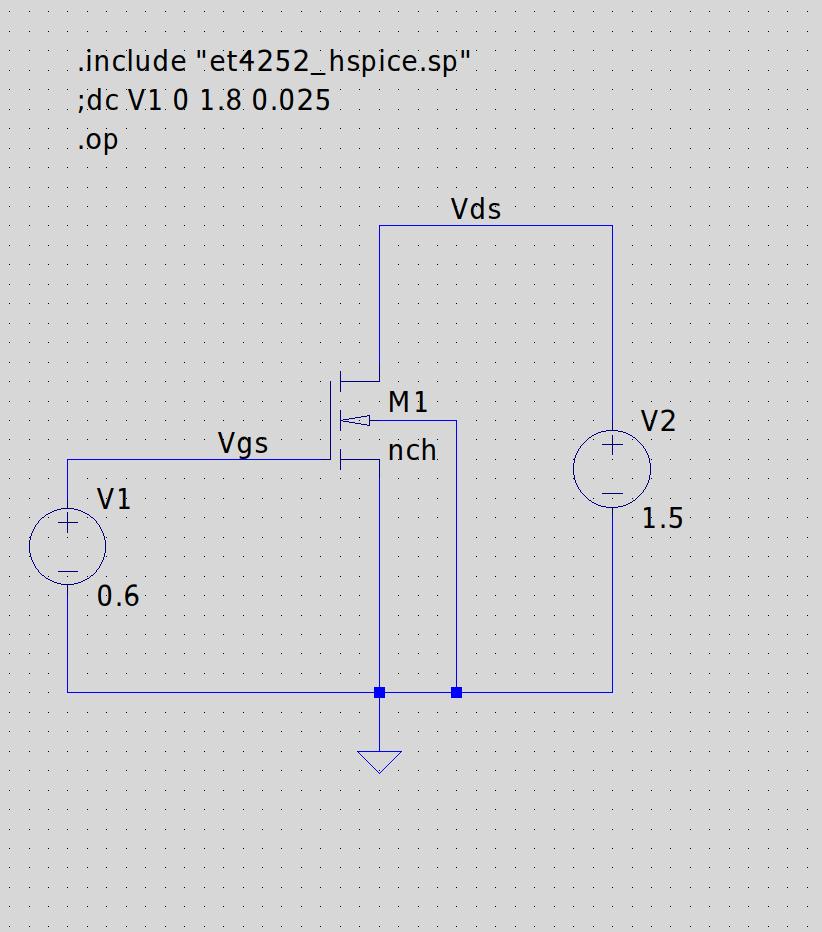
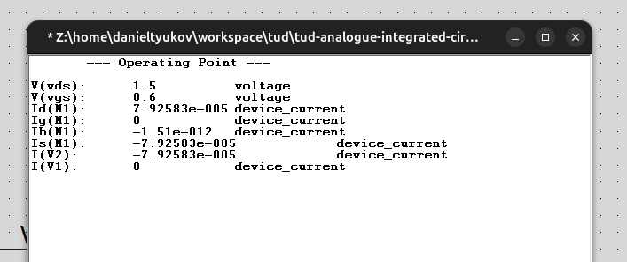
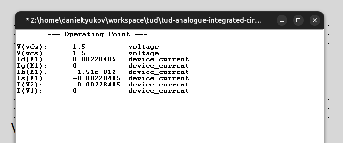

# Homework Assignment 2

## ANALOGUE INTEGRATED CIRCUIT DESIGN — ET4252

**Authors:** Raghavendra Joshi (6438180), Daniel Tyukov (5714699)

---

## Part A

Use an operating point simulation (.op) to measure the drain current of an NMOS transistor with W/L = 5 μm / 0.18 μm at V_DS = 1.5V and V_GS = 0.6V and 1.5V.

### Circuit

NMOS M1 with `nch` model (BSIM3v3, 180nm technology), W/L = 5 μm / 0.18 μm. V_DS = 1.5V provided by V2, V_GS swept via V1. Bulk tied to source (ground).

### Operating Point Results

| V_GS  | V_DS  | I_D              |
|-------|-------|------------------|
| 0.6 V | 1.5 V | 79.26 μA         |
| 1.5 V | 1.5 V | 2.284 mA         |

**V_GS = 0.6V:**

**V_GS = 1.5V:**

---
